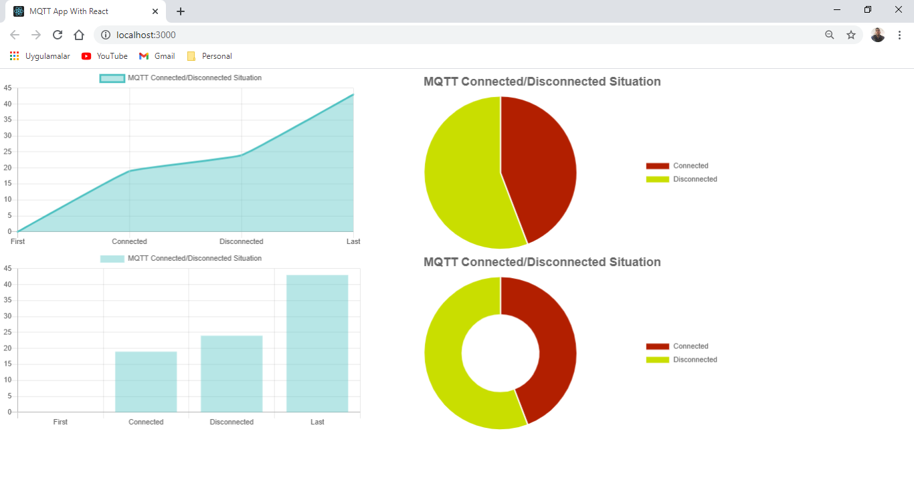

# MQTT_ReactJS (PART - 2)
I made an MQTT project Frontend side with using ReactJS. ReactJS is really useful and popular framework nowadays. Because it porvides so much useful libraries and let integrate however you want. That's why it is impresive for me to make so many project and let me improve more about being Frontend Developer.

## ReactJS

# Kullanılan Teknolojiler

- React Javascript
- JSON

## Setup

- Install Visual Studio 2019
- npm install
- npm start
- Don't forget to replace data.json with your JSON data
- Copy that JSON data paste it React Section Of Project (data.json)
- Then You are done with this section too
- You can see data with Chart.js Visualization
- Congratulations!
